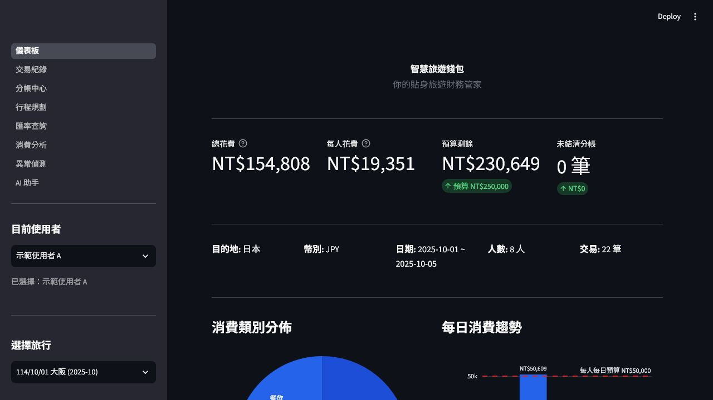
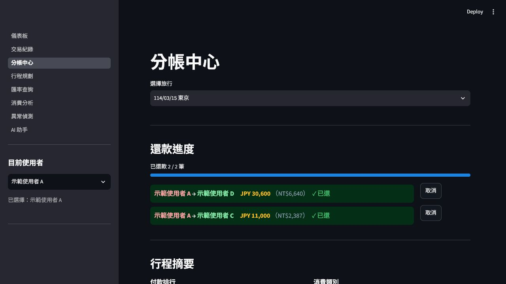
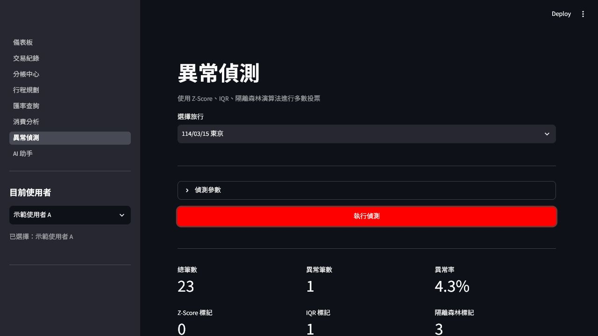
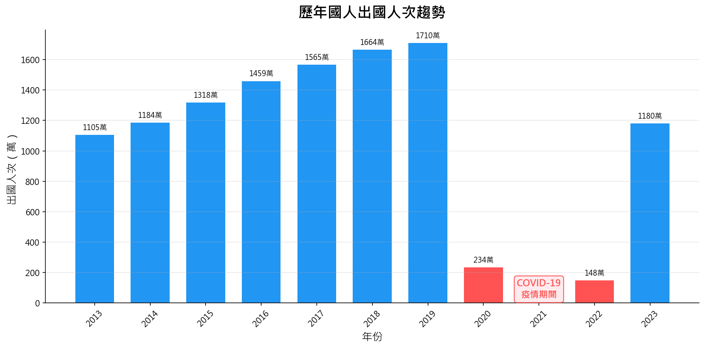
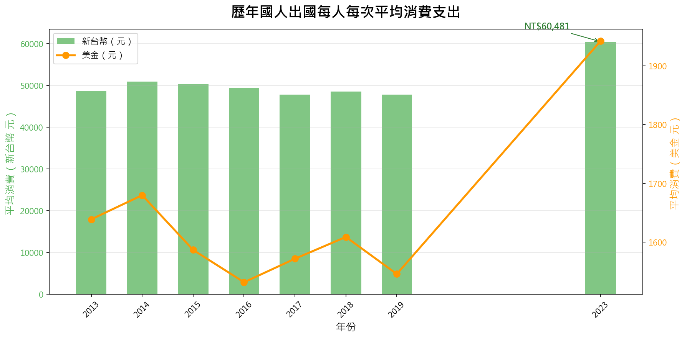
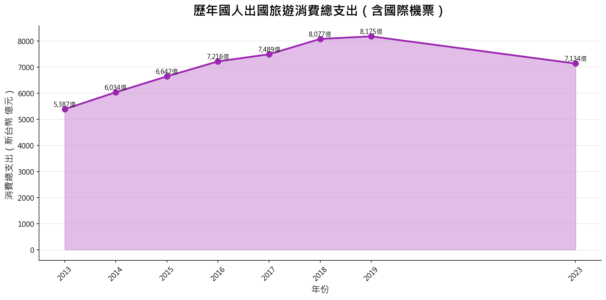
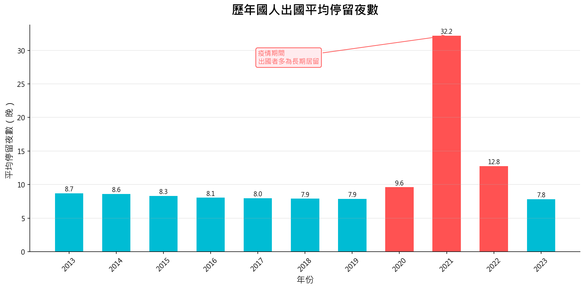
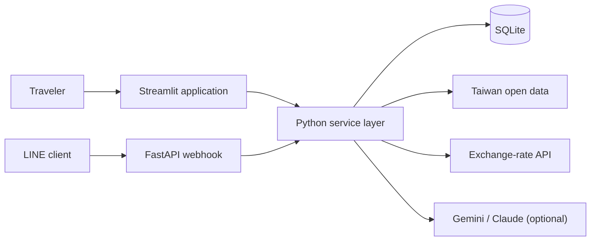

# TravelWallet

> A travel-finance application for expense tracking, split bills, budget
> planning, exchange-rate monitoring, and AI-assisted spending analysis.

[](https://www.python.org/)
[](https://streamlit.io/)
[](https://fastapi.tiangolo.com/)
[](tests)
[](LICENSE)

TravelWallet combines personal travel expenses with Taiwan government tourism
statistics. It demonstrates financial data modeling, multi-currency accounting,
debt netting, anomaly detection, forecasting, and optional LLM integrations in
one portfolio project.

**中文簡介：** TravelWallet 是一套旅遊財務管理工具，整合多人分帳、最少轉帳
結算、預算規劃、匯率提醒、異常消費偵測與 AI 財務問答。公開範例只使用虛構
使用者資料。

## Core features

- Record multi-currency transactions and normalize them to TWD
- Split expenses equally, proportionally, or by custom amounts
- Calculate a minimal settlement plan with greedy debt netting
- Compare group spending with Taiwan tourism open data
- Detect anomalous transactions with Z-Score, IQR, and Isolation Forest voting
- Forecast budget burn and recommend destination-specific budget tiers
- Monitor exchange rates and configurable rate alerts
- Parse receipts with OCR and support optional AI-assisted extraction
- Answer structured finance questions with a local rule engine
- Use Gemini or Claude only when the related API key is configured
- Expose an optional LINE Bot webhook through FastAPI

## Product preview

All screens below use fictional demonstration users and generated transactions.

| Dashboard | Split-bill settlement |
|---|---|
|  |  |



## Open-data analytics preview

The charts below are generated from public tourism statistics and contain no
personal travel records.

| Outbound travel trend | Spending trend |
|---|---|
|  |  |

| Total spending | Average stay |
|---|---|
|  |  |

## Architecture



| Layer | Technology |
|---|---|
| User interface | Streamlit, Plotly |
| Bot interface | FastAPI, LINE Bot SDK |
| Core services | Python, SQLAlchemy |
| Data store | SQLite |
| Analytics | pandas, NumPy, scikit-learn |
| AI integrations | Gemini REST API, Anthropic Messages API |
| Validation | pytest |
| Deployment | Render |

## Run locally

Requirements: Python 3.11+.

```bash
git clone https://github.com/febsi29/TravelWallet.git
cd TravelWallet
python -m venv .venv
```

Activate the virtual environment:

```powershell
# Windows PowerShell
.\.venv\Scripts\Activate.ps1
```

```bash
# macOS / Linux
source .venv/bin/activate
```

Install dependencies and create the demonstration database:

```bash
python -m pip install -r requirements.txt
copy .env.example .env
python init_db.py
python database/seed_data.py
```

On macOS or Linux, replace the `copy` command with:

```bash
cp .env.example .env
```

Start the Streamlit application:

```bash
streamlit run app/main.py
```

Then open `http://localhost:8501`.

The application works without external credentials. Live exchange rates and AI
features are optional; missing services fall back to offline rates or the local
rule engine.

## Optional configuration

Copy `.env.example` to `.env` and set only the integrations you want to use:

| Variable | Purpose |
|---|---|
| `DB_PATH` | Custom SQLite database location |
| `EXCHANGE_RATE_API_KEY` | Live exchange-rate data |
| `GEMINI_API_KEY` | Gemini travel-finance assistant |
| `ANTHROPIC_API_KEY` | Claude assistant and Vision OCR |
| `LINE_CHANNEL_SECRET` | LINE webhook signature verification |
| `LINE_CHANNEL_ACCESS_TOKEN` | LINE Bot responses |
| `LIFF_ID` | Optional LIFF application |
| `STREAMLIT_URL` | Public Streamlit URL used by the bot |

Never commit `.env` or production credentials.

## Quality checks

```bash
python -m pytest
python -m ruff check .
python -m mypy src config
```

The test suite covers budgeting, currency conversion, split-bill settlement,
payments, OCR safeguards, anomaly detection, forecasting, community features,
wallet operations, and risk analysis. The current suite contains **252 passing
tests**.

## Repository structure

```text
.
├── app/                    # Streamlit application and pages
├── linebot_app/            # FastAPI LINE Bot webhook
├── src/                    # Domain services and analytics
├── database/               # SQLite schema and fictional seed data
├── data/                   # Public source-data workspace
├── notebooks/              # Exploratory analysis
├── tests/                  # Automated pytest suite
├── config/                 # Environment-based configuration
├── render.yaml             # Render deployment definition
└── README.md
```

## Privacy and security

- Demonstration users are fictional and use `demo_a` through `demo_h`.
- API credentials are read only from environment variables.
- `.env`, local databases, caches, and AI-tool configuration are excluded from
  version control.
- Do not commit real receipts, names, travel records, payment information, or
  account identifiers.
- If a credential is exposed, revoke it before removing it from Git history.

See [SECURITY.md](SECURITY.md) for reporting guidance.

## Data attribution

Tourism statistics are sourced from Taiwan government open-data services and
remain subject to their original data licenses. The application code is
released under the [MIT License](LICENSE).
